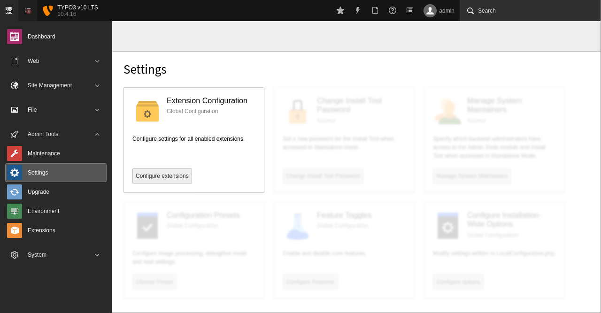
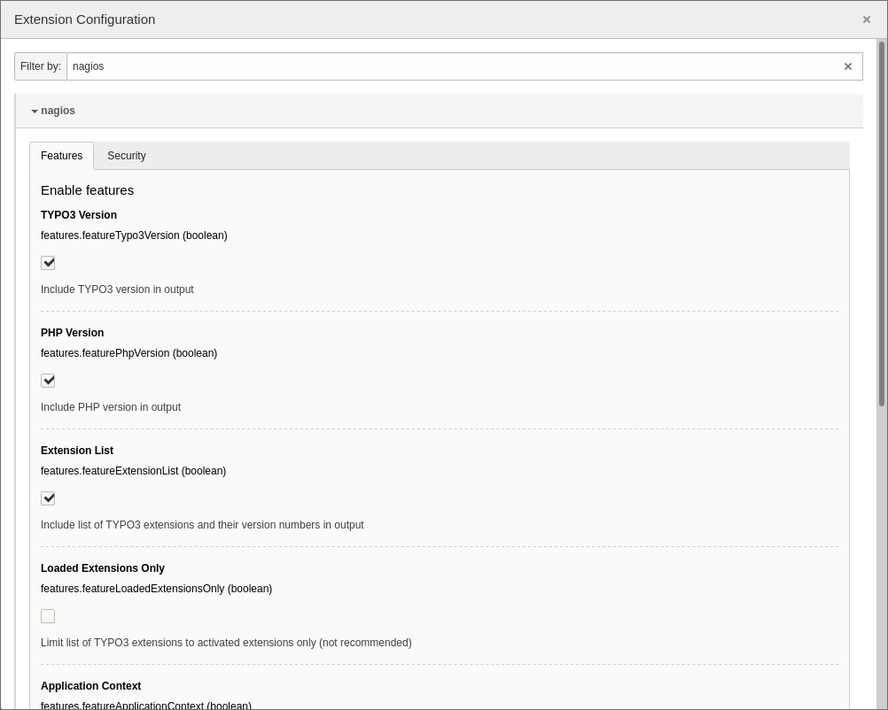

# Configuration

Open the extension configuration through the **Admin Tools → Settings → Extension Configuration**. If you don't see the **Admin Tools** in the TYPO3 backend, your backend user must be added as a *system maintainer*.

Locate the extension “**nagios**” and open the configuration. The configuration options are divided into two tabs which are labelled **Features** and **Security**:

➤ Read next: configure [features](Features/Index.md) or [security options](Security/Index.md).
