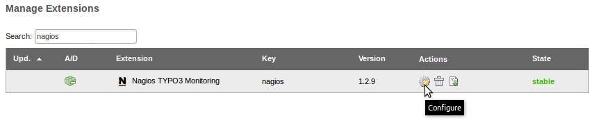

.. ==================================================
.. FOR YOUR INFORMATION
.. --------------------------------------------------
.. -*- coding: utf-8 -*- with BOM.

.. ==================================================
.. DEFINE SOME TEXTROLES
.. --------------------------------------------------
.. role::   underline
.. role::   typoscript(code)
.. role::   ts(typoscript)
   :class:  typoscript
.. role::   php(code)

.. _configuration:

Configuration
^^^^^^^^^^^^^

The following settings let you define which information should be passed to the Nagios® server. Depending on your system and TYPO3 version more or less of the following options are available. You can change the configuration via the "Extension Manager" (EM) as a backend user with administrator privileges by accessing the extension configuration as shown in the following illustration:

   Illustration 6: Access the configuration in the Extension Manager

Configuration Options: Features
"""""""""""""""""""""""""""""""

.. t3-field-list-table::
 :header-rows: 1

 - :Option:
      Option
   :Output:
      Output example
   :Description:
      Description
   :Default:
      Default

 - :Option:
      TYPO3 version
   :Output:
      ``TYPO3:version-7.6.0``
   :Description:
      Enable or disable the feature to include the version of the TYPO3 instance in the output. This might be useful to monitor if a specific version of TYPO3 becomes insecure and Nagios® should inform (warn) system administrators.
   :Default:
      enabled

 - :Option:
      PHP version
   :Output:
      ``PHP:version-5.6.4``
   :Description:
      Enable or disable the feature to include the version of PHP in the output. This might be useful to monitor if a specific version of PHP becomes insecure, is unstable or is known as incompatible with TYPO3 and Nagios® should inform (warn) system administrators.
   :Default:
      enabled

 - :Option:
      List TYPO3 extensions and their versions
   :Output:
      ``EXT:templavoila-1.5.0``
   :Description:
      Enable or disable the feature to include the extension key and version of all extensions in the output. This might be useful to monitor if a specific version of a specific TYPO3 extension becomes insecure and Nagios® should inform (warn) system administrators.
   :Default:
      enabled

 - :Option:
      Limit extension list to loaded extensions only
   :Output:
      *see above*
   :Description:
      Limit the extension list to loaded extensions only (not recommended). See additional notes below.
   :Default:
      disabled

 - :Option:
      Status of deprecation log
   :Output:
      ``DEPRECATIONLOG:enabled``
   :Description:
      Enable or disable the feature th include the status of the deprecation log setting in the output. Any usage of deprecated functions in TYPO3's API or TypoScript is written to a deprecation log file. This is a nice feature but in large production environments the log file may grow rapidly (depending on amount of requests, extensions used and other circumstances). The TYPO3 Nagios® Extension can warn system administrators if this feature is enabled (very useful for production sites).
   :Default:
      enabled

 - :Option:
      Application context
   :Output:
      ``APPLICATIONCONTEXT:development``
   :Description:
      Enable or disable the feature to include the current timestamp and timezone of the TYPO3 server in the output. This might be useful to monitor in order to detect caching issues with the output or incorrect date/time settings of the TYPO3 server.
   :Default:
      enabled

 - :Option:
      Disk usage size
   :Output:
      ``DISKUSAGE:158042124``
   :Description:
      Enable or disable the feature to include the size of current disk usage (in bytes) by the TYPO3 instance in the output. This feature requires that TYPO3 runs on a UNIX/Linux server (on Microsoft Windows systems no output or the value "not-supported" will be be shown). See additional notes below.
   :Default:
      disabled

 - :Option:
      Site name
   :Output:
      ``SITENAME:TYPO3+CMS+7+LTS``
   :Description:
      Enable or disable the feature to include the site name of the TYPO3 instance in the output. The site name can be configured in the Install Tool and all characters except A to Z, digits 0 to 9, spaces, dots and dashes are filtered (removed from the string before output). The remaining string of characters is also be URL-encoded.
   :Default:
      disabled

 - :Option:
      Server name
   :Output:
      ``SERVERNAME:example.com``
   :Description:
      Enable or disable the feature to include the server name in the output. The server name is the name of the server (e.g. virtual host) as set in the web server configuration - or the HTTP hostname sent by the client. The value is URL-encoded.
   :Default:
      disabled

 - :Option:
      Timestamp and timezone
   :Output:
      ``TIMESTAMP:1449365710-UTC``
   :Description:
      Enable or disable the feature to include the current timestamp and timezone of the TYPO3 server in the output. This might be useful to monitor in order to detect caching issues with the output or incorrect date/time settings of the TYPO3 server.
   :Default:
      enabled

Configuration Options: Access
"""""""""""""""""""""""""""""

.. t3-field-list-table::
 :header-rows: 1

 - :Option:
      Option
   :Output:
      Output example
   :Description:
      Description
   :Default:
      Default

 - :Option:
      IP addresses of Nagios(R) servers
   :Output:
      N/A
   :Description:
      This setting lets you limit the access to information about the TYPO3 instance. You can define one or more IP address(es) or fully qualified hostnames of hosts which are allowed to retrieve information from the TYPO3 instance. Separate two or more values by comma(s). The :ref:`next chapter <restrict-access-by-remote-ip-address>` shows an example. Please see chapter :ref:`security-aspects` for further information.
   :Default:
      ``127.0.0.1``

 - :Option:
      TYPO3 behind proxy server
   :Output:
      N/A
   :Description:
      Enable or disable the feature to take IP addresses forwarded by proxy servers in HTTP header into account, when checking, if a client is allowed to retrieve information from the TYPO3 instance. If you have not placed a proxy server in front of the TYPO3 instance or if you are in doubt, **leave this checkbox unticked**. Please see chapters :ref:`typo3-behind-a-proxy` and the related :ref:`security aspects <security-aspects-typo3-behind-a-proxy-server>` for further information.
   :Default:
      disabled

 - :Option:
      Suppress header line
   :Output:
      N/A
   :Description:
      The output of the extension shows a few lines with prefixed ``#`` as comments, even if the access to the output is denied. Those comments include the extension name, extension version, etc. I have been asked to suppress these lines and I implemented an option to allow administrators to deactivate them. Nevertheless, I am convinced that "security by obscurity" is definitely not the best approach and it should not make a difference to activate or deactivate this feature. If you are in doubt, **leave this checkbox unticked**.
   :Default:
      disabled

Additional Notes
""""""""""""""""

Show Loaded TYPO3 Extensions Only
~~~~~~~~~~~~~~~~~~~~~~~~~~~~~~~~~

TYPO3 has the concept of installed (imported) extensions and loaded extensions. An extension can be imported (e.g. by using the Extension Manager), which means, its files are copied to the extension directory (for example ``typo3conf/ext/``). This does **not** mean, the extension is really used – it is installed/imported only. In order to enable it and make it available in the system, it has to be *activated*.

From a security perspective, unused TYPO3 extensions should not exist in the system (somewhere in the publicly accessible *DocumentRoot* of the web server). Even though they are not enabled (and TYPO3 never executes their code), the files reside in the file system and are accessible/readable/executable by the web server (and by a remote call).

The extension list generated by the Nagios TYPO3 extension contains all extensions by default, no matter if they are activated or just installed and not activated. Optionally, you can exclude inactive extensions from the list.

Please note, that including loaded extensions only is not recommended due to the fact that extensions with security vulnerabilities are causing a risk, even if they are not loaded and system administrators should monitor these extensions, too (or remove them from the system).

Size of Current Disk Usage
~~~~~~~~~~~~~~~~~~~~~~~~~~

This feature requires that TYPO3 runs on a UNIX/Linux server (on Microsoft Windows systems no output or the value "not-supported" will be be shown).

Please note that the value is not 100% reliable and depends on some conditions. First of all, the UNIX/Linux command ``du`` (disk usage) has to be installed, available and executable by the system user who runs the web server (e.g. "www-data"). Secondly, if the system user does not have access to all subdirectories of the TYPO3 root folder, not all data can be counted and the result may be inaccurate.
