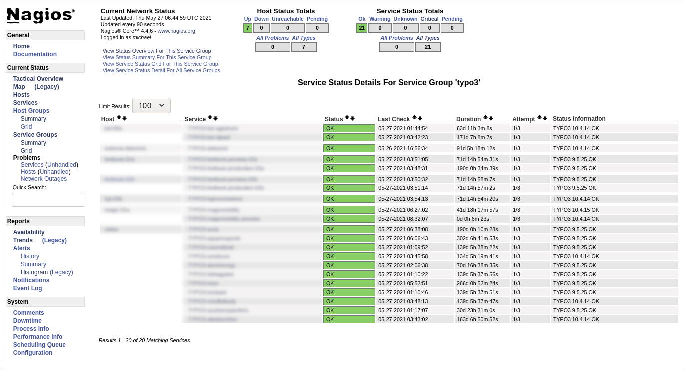
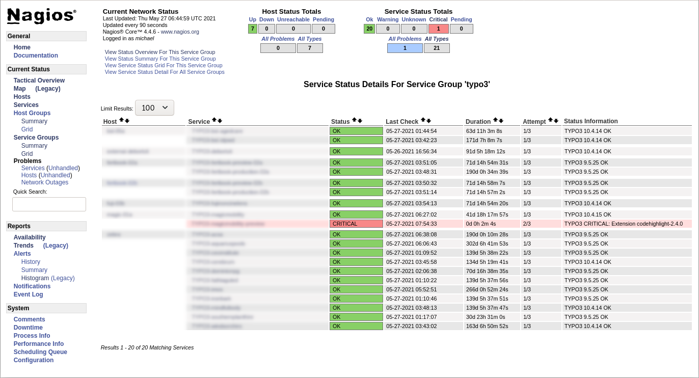

# Screenshots

The following screenshots clarify the extension configuration options and provide an example on how Nagios® could interpret the data generated by the TYPO3 extension “Nagios”.

**Screenshot above:**
The extension configuration lets you enable or disable each value that the TYPO3 instance should expose. The Nagios® TYPO3 plugin (the counterpart of the extension) reads the output and reacts according to its configuration (for example triggers a warning if the TYPO3 version is outdated or an extension insecure).

---

**Screenshot above:**
A typical view of the Nagios® server web interface. The summary of the service group “TYPO3” lists all TYPO3 instances and gives system administrators a quick overview that all sites are “OK”, which servers (hosts) they are running on, and which TYPO3 version they are using.

---

**Screenshot above:**
The same Nagios® server web interface as above. However, in this case Nagios® detected an insecure extension (“Code Highlight” version 2.4.0, see [TYPO3 Security Bulletin TYPO3-EXT-SA-2021-002](https://typo3.org/security/advisory/typo3-ext-sa-2021-002)). You can configure if Nagios® should treat this issue as a critical problem or just a warning. Further characteristics Nagios® could monitor are, for example, TYPO3 versions, PHP versions, etc.

---

➤ Next chapter: [Installation and Setup](../../InstallationAndSetup/Index.md).
