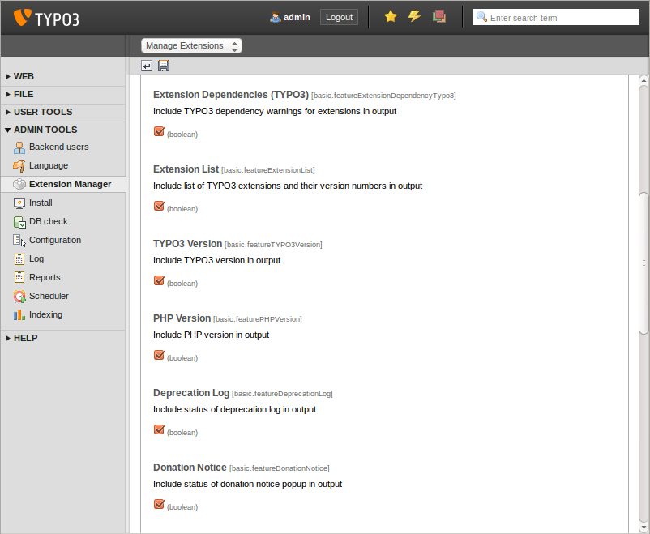
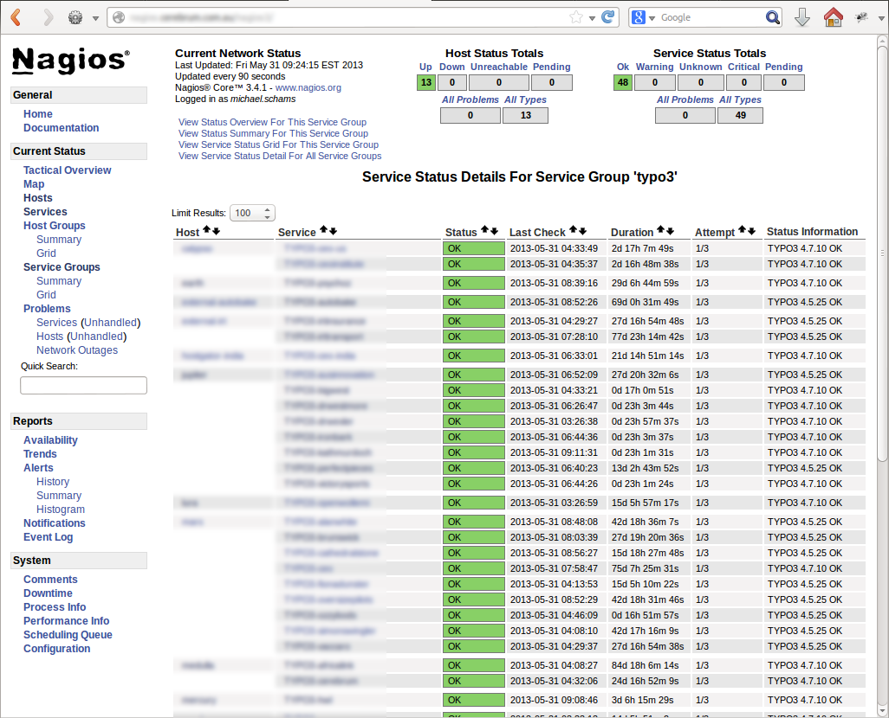
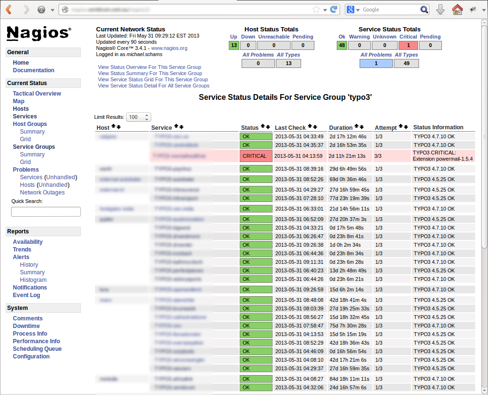

.. ==================================================
.. FOR YOUR INFORMATION
.. --------------------------------------------------
.. -*- coding: utf-8 -*- with BOM.

.. ==================================================
.. DEFINE SOME TEXTROLES
.. --------------------------------------------------
.. role::   underline
.. role::   typoscript(code)
.. role::   ts(typoscript)
   :class:  typoscript
.. role::   php(code)

Screenshots
^^^^^^^^^^^

The following screenshots clarify the extension configuration options and provide an example how Nagios® could interpret the data generated by the TYPO3 Nagios® Extension.

   Illustration 3: Extension configuration

**Screenshot above:**
The extension configurations allow you to enable or disable each feature of the TYPO3 instance. The settings control which information should be passed to Nagios®. The Nagios® TYPO3 plugin (the counterpart of the extension) reads this data and reacts according to the configuration (for example: triggers a warning if TYPO3 reports an old version).

   Illustration 4: Nagios output (no errors, no warnings)

**Screenshot above:**
A typical view of the Nagios® server web interface. The summary of the service group “TYPO3” lists all TYPO3 instances and gives system administrators a quick overview that all sites are “OK”, which servers (hosts) they are running on and which TYPO3 version they are using.

   Illustration 5: Nagios output shows a critical error

**Screenshot above:**
The same Nagios® server web interface – but in this case Nagios® detected an insecure extension (powermail version 1.5.4, see `TYPO3 Security Bulletin TYPO3-SA-2010-021 <http://typo3.org/teams/security/security-bulletins/typo3-extensions/typo3-sa-2010-021/>`_) and was configured to generate a critical condition for the appropriate server. Other options would be to configure Nagios® to generate warnings if the TYPO3 version is outdated or the PHP version is a specific one for example.
