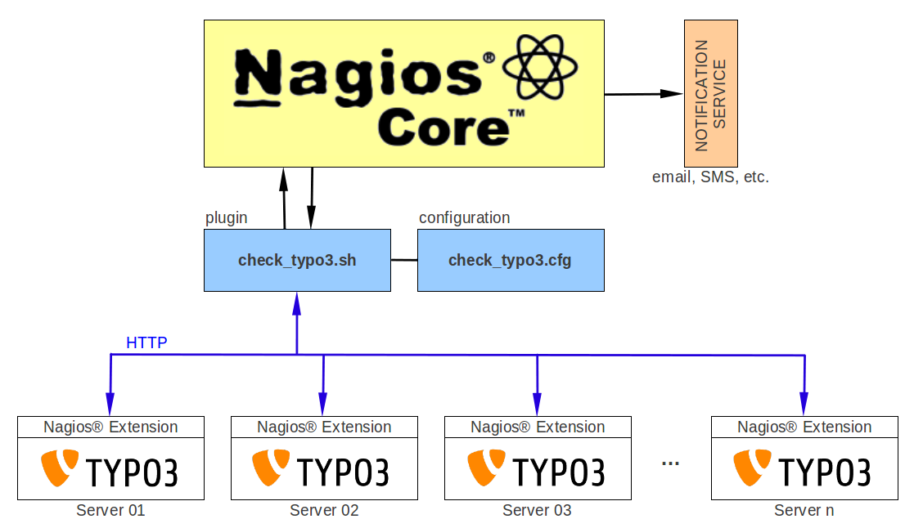

.. ==================================================
.. FOR YOUR INFORMATION
.. --------------------------------------------------
.. -*- coding: utf-8 -*- with BOM.

.. ==================================================
.. DEFINE SOME TEXTROLES
.. --------------------------------------------------
.. role::   underline
.. role::   typoscript(code)
.. role::   ts(typoscript)
   :class:  typoscript
.. role::   php(code)

Technical Concept
^^^^^^^^^^^^^^^^^

The following illustration shows the technical concept of a typical monitoring system.

   Illustration 2: Technical concept

Simplified, the Nagios® core executes its plugin ``check_typo3.sh`` in a configured time interval. The plugin reads the configuration (``check_typo3.cfg``) and requests the TYPO3 server via HTTP/HTTPS. The request includes a unique eID (``eID=nagios``) and (optionally) further parameters.

TYPO3 receives the request and executes the Nagios® extension which checks if the requesting server is allowed to access the data. If so, the extension gathers information about the TYPO3 instance (all information is configurable in the TYPO3 backend) and shows it in a propriety format (text/plain).

The Nagios® plugin reads the response, analyzes the data and checks the information against its configuration. According to the configuration, one of the following states is reported back to the Nagios® Core (in addition to a meaningful condition description):

- OK

- WARNING

- CRITICAL

- UNKNOWN

Finally, the Nagios® Core reacts appropriately to this states and may notify system administrators. This depends on the Nagios configuraiton and could be for example an email, a text message to a mobile phone, a message to a team collaboration platform such as `Slack <https://slack.com>`_, etc.
